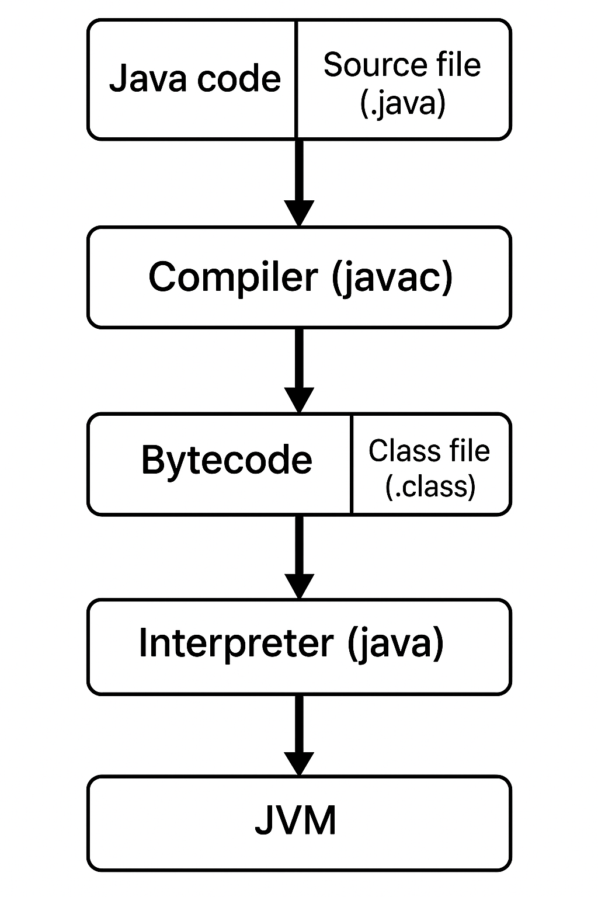
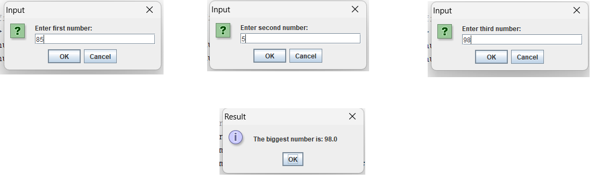
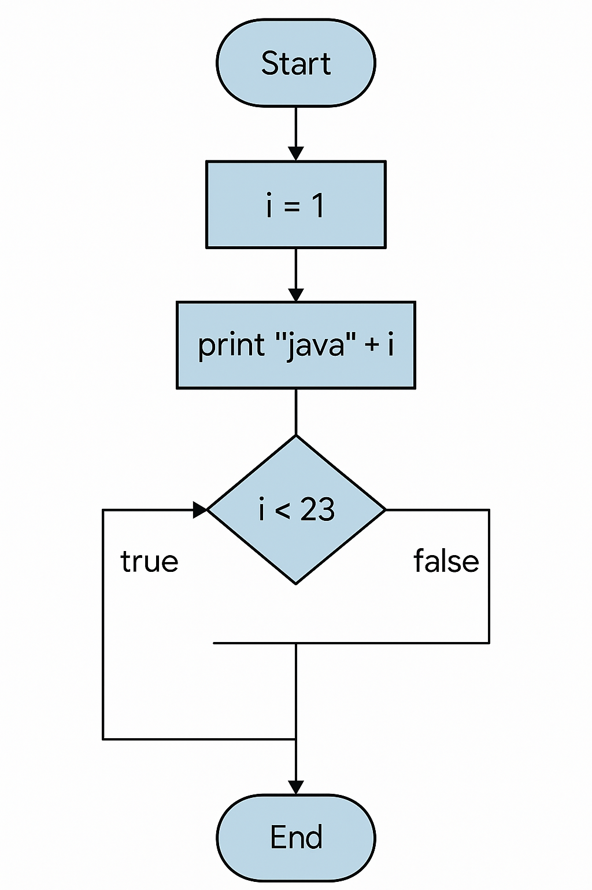
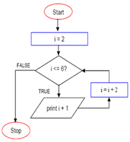

# 📘 Java Book – Exercises & Solutions (Eng.Reema Ali Asker)

This document provides all the exercises from the book along with their solutions, grouped by topic and includes example outputs.

---

## 🗂 Table of Contents

- [🛠️🔍 Understanding](#--understanding)
- [🛠️ Java Development Environment Setup Guide](#-java-development-environment-setup-guide)
- [✅ Basic Tasks](#-basic-tasks)
- [🔧 Operations](#-operations)
- [🔷 Decision Statement](#-decision-statement)
- [🔤 Input,Output](#-input-and-output)
- [🔁 Loops](#-loops)
- [🔧 Methods](#-methods)
- [🔁 Recursion](#-recursion)
- [📦 Arrays](#-arrays)
- [2️⃣🅰️ 2DA](#2️⃣🅰️-2da)
- [🛍 Final Project (Product Management System)](#-final-project-product-management-system)
---
## 🛠️🔍 Understanding

When working with Java, you'll encounter three essential components: **JRE**, **JDK**, and **JVM**. Here's a simple breakdown to understand their differences and how they work together.

🛠️🔍 Understanding JRE JDK and JVM
---

## 🔍 What Are They?

### **JVM (Java Virtual Machine)**  
- **Definition**: A virtual machine that runs Java bytecode.
- **Purpose**: Converts compiled Java code (bytecode) into machine code, making Java platform-independent.
- **Key Role**: Executes programs.

### **JRE (Java Runtime Environment)**  
- **Definition**: A runtime environment required to run Java applications.
- **Purpose**: Includes JVM and libraries required for running Java applications.
- **Key Role**: Ensures Java programs can run.

### **JDK (Java Development Kit)**  
- **Definition**: A complete package for Java development.
- **Purpose**: Includes tools to write, compile, and debug Java programs, as well as JRE.
- **Key Role**: Enables Java development.

---

## 📊 Comparison Chart

| Feature             | JVM                      | JRE                       | JDK                       |
|---------------------|--------------------------|---------------------------|---------------------------|
| **Definition**      | Virtual machine to run Java programs | Environment to run Java programs | Toolkit to develop Java programs |
| **Includes**        | Bytecode interpreter     | JVM + libraries           | JRE + development tools   |
| **Use Case**        | Runs Java programs       | Executes Java programs    | Develops and runs Java programs |
| **Tools**           | None                    | Standard libraries        | Compiler, debugger, tools |

---

## 🚦 How They Work Together

1. **You write a Java program.**
2. **JDK**: Compiles your code into bytecode using tools like `javac` (Java Compiler).
3. **JRE**: Provides the runtime environment with libraries to execute the bytecode.
4. **JVM**: Converts bytecode into machine code for your specific operating system and hardware.


## 🗺️ Conceptual Diagram

```plaintext
+--------------------------------+
|            JDK                 |
|--------------------------------|
| Compiler | Debugger | Tools    |
|          +---------------------+
|          |         JRE         |
|          +---------------------+
|          | JVM + Libraries     |
|          +---------------------+
|          |     JVM             |
|          +---------------------+
```

## How Java Code Operate using compiler and interpter (based on JDK tools) :


---
## 🛠️ Java Development Environment Setup Guide

This guide provides step-by-step instructions to set up the Java Development Kit (JDK) and configure your environment variables on Windows and macOS. Follow this guide to prepare your system for Java development and related tools like [Apache ANT](https://documentation.provar.com/documentation/devops/apache-ant/ant-licensing/).

---

## 📥 Step 1: Download and Install JDK

### Download JDK

We recommend [Amazon Corretto 11](https://docs.aws.amazon.com/corretto/latest/corretto-11-ug/downloads-list.html) for its compatibility and ease of use. Supported versions include:

- 11.0.21.9
- 11.0.20.1
- 11.0.19.7
- 11.0.18.10
- 11.0.16.1

Alternatively, you can download the JDK from [Oracle's official page](https://www.oracle.com/java/technologies/javase-downloads.html). 

1. Scroll to the "JDK Downloads" section.
2. Agree to the license terms.
3. Select your system version (e.g., Windows x64 or macOS).
4. Click the download link to start the download.


### Install JDK

1. Locate and run the downloaded installer (`.exe` for Windows or `.pkg` for macOS).
2. Follow the setup wizard:
   - Click **Next**.
   - Select the installation path (or use the default).
   - Click **Install**.
3. After installation completes, click **Finish**.


---

## ⚙️ Step 2: Configure Environment Variables

After installing the JDK, configure your system's environment variables to ensure Java is accessible from the command line.

### On Windows

1. **Open System Properties**:  
   - Right-click **This PC** → **Properties** → **Advanced system settings**.  
   - In the **Advanced** tab, click **Environment Variables**.

   

2. **Add JAVA_HOME**:  
   - Under **System variables**, click **New**.
   - Set:
     - **Variable name**: `JAVA_HOME`
     - **Variable value**: `C:\Program Files\Java\jdk-11.0.21_9` (or your installation path).

3. **Update the Path Variable**:  
   - Select the `Path` variable and click **Edit**.
   - Add a new entry: `%JAVA_HOME%\bin`.

4. **Save and Restart**:  
   - Click **OK** to save changes.
   - Restart your system.

5. **Verify Installation**:  
   Open Command Prompt and type:
   ```bash
   java -version


### On Mac

1. **Locate or Create the Profile File**:  
   - Open Finder and navigate to your home directory (**Shift + Command + H**).
   - Show hidden files by pressing **Command + Shift + Period**.
   - Open or create a `.bash_profile` file (or `.zshrc` for newer macOS versions using zsh).

   

2. **Add Environment Variables**:  
   Edit the profile file to include the following lines:
   ```bash
   export JAVA_HOME=$(/usr/libexec/java_home)
   export PATH=$PATH:$JAVA_HOME/bin
---

## Install an IDE (Optional but Recommended)

### 🔷 IntelliJ IDEA

- Download from [JetBrains IntelliJ](https://www.jetbrains.com/idea/download/)
- Install the **Community Edition**.
- Configure IntelliJ to use the installed JDK.

> 💡 When creating a new project, IntelliJ will prompt you to select a JDK. Choose the one you installed earlier (e.g., `jdk-17`).

---

### 🔷 Eclipse

- Download from [Eclipse Downloads](https://www.eclipse.org/downloads/)
- Install **Eclipse IDE for Java Developers**.
- Launch Eclipse and set the installed JDK in:
Window → Preferences → Java → Installed JREs

---

## 6. Write and Run Your First Java Program

1. Open your IDE (IntelliJ or Eclipse).
2. Create a new Java project.
3. Create a new Java class named `HelloWorld.java`.
4. Paste the following code:

```java
public class HelloWorld {
  public static void main(String[] args) {
      System.out.println("Hello, World!");
  }
}
```
Run the program.

✅ You should see this output in the console:
```java
Hello, World!
```
---
## ✅ Basic Tasks


### 📝 Exercise
Write suitable import statements to use Arrays and JOptionPane.

### ✅ Solution
```java
import java.util.Arrays;
import javax.swing.JOptionPane;
}
```


### 📝 Exercise
Create a class FirstLecture, add a main method 

### ✅ Solution
```java
public class FirstLecture {
    public static void main(String[] args) {
   
    }
}
```

### 📝 Exercise
what is the Suitable type for storing the following values :
(10 : ------------------ , -200 :------------------ , 57.6879: --------------- ,2,147,483,699 : ‘$’:------------“My name is Reema”: ------------------, 
the value of the answer "Are you a student? ------------------     ) 

### ✅ Solution

1. **10**  
   - **Suitable type**: `byte`  
   - **Memory usage**: 1 byte  
   - **Reasoning**: The value `10` fits within the `byte` range (-128 to 127), making it the most memory-efficient choice.  
   - Example: `byte num = 10;`

2. **-200**  
   - **Suitable type**: `short`  
   - **Memory usage**: 2 bytes  
   - **Reasoning**: The value `-200` fits within the `short` range (-32,768 to 32,767), making `short` more suitable than `int`.  
   - Example: `short num = -200;`

3. **57.6879**  
   - **Suitable type**: `float`  
   - **Memory usage**: 4 bytes  
   - **Reasoning**: Since the value is a floating-point number, `float` is the appropriate choice for less precision and reduced memory consumption.  
   - Example: `float num = 57.6879f;` (Note the `f` suffix for `float`)

4. **2,147,483,699**  
   - **Suitable type**: `long`  
   - **Memory usage**: 8 bytes  
   - **Reasoning**: The value exceeds the `int` range, so `long` is required to store this large number.  
   - Example: `long num = 2_147_483_699L;` (Note the `L` suffix for `long`)

5. **'$'**  
   - **Suitable type**: `char`  
   - **Memory usage**: 2 bytes  
   - **Reasoning**: A single character can be efficiently stored using the `char` type, which is 2 bytes.  
   - Example: `char symbol = '$';`

6. **"My name is Reema"**  
   - **Suitable type**: `String`  
   - **Memory usage**: Depends on string length (2 bytes per character in UTF-16 encoding)  
   - **Reasoning**: A sequence of characters is best stored as a `String`.  
   - Example: `String name = "My name is Reema";`

7. **"Are you a student?"**  
   - **Suitable type**: `String`  
   - **Memory usage**: Depends on string length (2 bytes per character in UTF-16 encoding)  
   - **Reasoning**: The question should be stored as a `String`.  
   - Example: `String question = "Are you a student?";`

### Summary of Memory Usage:

| Value                    | Suitable Type | Memory Usage |
|--------------------------|---------------|--------------|
| **10**                   | `byte`        | 1 byte       |
| **-200**                  | `short`       | 2 bytes      |
| **57.6879**               | `float`       | 4 bytes      |
| **2,147,483,699**         | `long`        | 8 bytes      |
| **'$'**                   | `char`        | 2 bytes      |
| **"My name is Reema"**    | `String`      | Variable (2 bytes per character) |
| **"Are you a student?"**  | `String`      | Variable (2 bytes per character) |
---
### 📝 Exercise
How can we store Reema Asker in Java?
How can we store 1999.6 with best data type in Java?
How can we store true in Java?
### ✅ Solution
1. **Storing "Reema Asker" in Java:**
   - **Suitable type**: `String`
   - **Reasoning**: A sequence of characters is best stored as a `String` in Java.
   - **Example**:
     ```java
     String name = "Reema Asker";
     ```

2. **Storing 1999.6 in Java:**
   - **Suitable type**: `double`
   - **Reasoning**: For storing decimal values with the best precision, `double` is typically the best choice as it uses 8 bytes and provides more precision than `float`.
   - **Example**:
     ```java
     double value = 1999.6;
     ```

3. **Storing `true` in Java:**
   - **Suitable type**: `boolean`
   - **Reasoning**: The `boolean` type is used for binary values such as `true` or `false`.
   - **Example**:
     ```java
     boolean isTrue = true;
     ```

### Summary:

| Value         | Suitable Type | Example Code                         |
|---------------|---------------|--------------------------------------|
| "Reema Asker" | `String`      | `String name = "Reema Asker";`       |
| 1999.6        | `double`      | `double value = 1999.6;`            |
| true          | `boolean`     | `boolean isTrue = true;`             |
---
### 🔧 Operations

1. **Initialization:**
     ```java
      int num = 25;
     ```
2. **Decrement:**
     ```java
      num--;
     ```
  The num-- operation reduces the value of num by 1. So, now num = 24.
 3. **Add 5:**
 ```java
   num += 5;
 ```
4. **Subtract 2:**
 ```java
   num -= 2;
 ```
This subtracts 2 from num. Now num = 29 - 2 = 27.
5.  **Increment :**
 ```java
   num++;
 ```
The num++ operation increases num by 1. Now num = 27 + 1 = 28.
6.  **Divide by 2 :**
 ```java
   num /= 2;
 ```
The num /= 2 operation divides num by 2. Now num = 28 / 2 = 14.

 **Final Value: :**
After all these operations, the value of num is 14.
 ```java
14
 ```

### 📝 Exercise
Make a simple program that has the following:
1. print your name
2. create a variable called my age with string data type and put your age .
3. convert the age as number (int)
4. print your age with added 5 years.

### ✅ Solution
```java
public class Main {
    public static void main(String[] args) {
        System.out.println("My name is Reema");
        String myAge = "23";
        int age = Integer.parseInt(myAge);
        System.out.println("My age after 5 years: " + (age + 5));
    }
}
```
📤 **Output:**
```
My name is Reema
My age after 5 years: 28
```
---
### 🔤 Input and output

### 🔍🔁 Program Analysis and Flowcharts
Exercise : Analysis and draw the flow chart of the following program:
The program will take the user's age as input and calculates their date of birth (DOB) .

Exercise :
Analyze and draw the flow chart of the following program:
The program will take an integer number as input and check if its even or odd . 


## 1. Age to DOB Program

### 🔍 Analysis
- Takes the user's **age** as input.
- Uses the current year (e.g., 2025) to calculate the **year of birth**.
- Displays the estimated **Date of Birth**.

### 🔁 Flowchart Steps
1. Start
2. Get current year
3. Input user's age
4. Calculate `DOB = current year - age`
5. Display DOB
6. End


### 📝 Exercise
Print your info(first name , last name ,age , nationality ) each one in a line. in java

### ✅ Solution
```java
public class PersonalInfo {
    public static void main(String[] args) {
        // Declaring the variables
        String firstName = "Reema";
        String lastName = "Asker";
        int age = 30; 
        String nationality = "Palestinine";

        // Printing each piece of information on a new line
        System.out.println("First Name: " + firstName);
        System.out.println("Last Name: " + lastName);
        System.out.println("Age: " + age);
        System.out.println("Nationality: " + nationality);
    }
}
```
📤 **Output:**
```
First Name: Reema
Last Name: Asker
Age: 30
Nationality: Palestinine
```


---
## 2. Even or Odd Checker

### 🔍 Analysis
- Takes an **integer input**.
- Checks if the number is divisible by 2.
- If `number % 2 == 0` → Even  
  Else → Odd

### 🔁 Flowchart Steps
1. Start
2. Input a number
3. Check `number % 2 == 0`
4. If Yes → Display "Even"
5. If No → Display "Odd"
6. End

---

## 🧩 Flowchart Image


---
### Input and Ouput ::


## Output by GUI :


```java
import javax.swing.JOptionPane;

public class MessageDialogsExample {
    public static void main(String[] args) {
        // First Window: Error message
        JOptionPane.showMessageDialog(
                null,
                "Warning Message",
                "Delete All Data",
                JOptionPane.ERROR_MESSAGE
        );

        // Second Window: Information message
        JOptionPane.showMessageDialog(
                null,
                "Success",
                "Data Recording",
                JOptionPane.INFORMATION_MESSAGE
        );

        // Third Window: Question message
        JOptionPane.showMessageDialog(
                null,
                "Are you Sure",
                "Question Message",
                JOptionPane.QUESTION_MESSAGE
        );

        // Fourth Window: Warning message
        JOptionPane.showMessageDialog(
                null,
                "Not valid input",
                "Error Message",
                JOptionPane.WARNING_MESSAGE
        );
    }
}
```
## Input by GUI

# Exercise "1" :

```java
public static void main(String[] args) {
        String firstName = JOptionPane.showInputDialog(
                null,
                "First name:",
                "Input",
                JOptionPane.QUESTION_MESSAGE
        );
        
            JOptionPane.showMessageDialog(
                    null,
                    "Hello "+firstName+ "!",
                    "Greeting",
                    JOptionPane.INFORMATION_MESSAGE
            );
       
    }
```
# Exercise "2" :


```java
    public static void main(String[] args) {
        String firstName = JOptionPane.showInputDialog(
                null,
                "First name:",
                "Input",
                JOptionPane.QUESTION_MESSAGE
        );
        String familyName = JOptionPane.showInputDialog(
                null,
                "Family Name:",
                "Input",
                JOptionPane.QUESTION_MESSAGE
        );
        JOptionPane.showMessageDialog(
                null,
                "You are  " + firstName + " " + familyName,
                "Greeting", JOptionPane.INFORMATION_MESSAGE
        );

    }
```
# Exercise "3" :
Exercise : Write a java program that allow user enter his name , age, grade and 3 marks and then display his name , age ,grade and the average of the entered marks .
[🎬 Watch the Solution](assets/exercise3_input_by_gui.mp4)


```java
import javax.swing.JOptionPane;

public class StudentInfo {
    public static void main(String[] args) {
        // Input
        String name = JOptionPane.showInputDialog(null, "Enter your name:", "Input", JOptionPane.QUESTION_MESSAGE);
        String ageStr = JOptionPane.showInputDialog(null, "Enter your age:", "Input", JOptionPane.QUESTION_MESSAGE);
        String grade = JOptionPane.showInputDialog(null, "Enter your grade:", "Input", JOptionPane.QUESTION_MESSAGE);
        String mark1Str = JOptionPane.showInputDialog(null, "Enter mark 1:", "Input", JOptionPane.QUESTION_MESSAGE);
        String mark2Str = JOptionPane.showInputDialog(null, "Enter mark 2:", "Input", JOptionPane.QUESTION_MESSAGE);
        String mark3Str = JOptionPane.showInputDialog(null, "Enter mark 3:", "Input", JOptionPane.QUESTION_MESSAGE);

        // Parsing numbers
        int age = Integer.parseInt(ageStr);
        double mark1 = Double.parseDouble(mark1Str);
        double mark2 = Double.parseDouble(mark2Str);
        double mark3 = Double.parseDouble(mark3Str);

        // Calculate average
        double average = (mark1 + mark2 + mark3) / 3;

        // Output
        String message = "Name: " + name + "\nAge: " + age + "\nGrade: " + grade + "\nAverage: " + average;
        JOptionPane.showMessageDialog(null, message, "Student Info", JOptionPane.INFORMATION_MESSAGE);
    }
}

```
# Exercise "4" :

Exercise : Write a java program that allow user enter 3 numbers and then print the biggest one.
``` java
import javax.swing.JOptionPane;

public class FindBiggestNumber {
    public static void main(String[] args) {
        // Input
        String num1Str = JOptionPane.showInputDialog(null, "Enter first number:", "Input", JOptionPane.QUESTION_MESSAGE);
        String num2Str = JOptionPane.showInputDialog(null, "Enter second number:", "Input", JOptionPane.QUESTION_MESSAGE);
        String num3Str = JOptionPane.showInputDialog(null, "Enter third number:", "Input", JOptionPane.QUESTION_MESSAGE);

        // Parsing
        double num1 = Double.parseDouble(num1Str);
        double num2 = Double.parseDouble(num2Str);
        double num3 = Double.parseDouble(num3Str);

        // Ternary operator to find the biggest number
        double biggest = (num1 > num2)
                            ? (num1 > num3 ? num1 : num3)
                            : (num2 > num3 ? num2 : num3);

        // Output
        JOptionPane.showMessageDialog(null, "The biggest number is: " + biggest, "Result", JOptionPane.INFORMATION_MESSAGE);
    }
}
```
Output:


## Input by Console

# Exercise : Write a java program let user enter his information (name , specialize , age ) and then print it in good way.
``` java
import java.util.Scanner;

public class UserInfo {
    public static void main(String[] args) {
        // Create Scanner object for input
        Scanner scanner = new Scanner(System.in);

        // Prompt and read user's name
        System.out.print("Enter your name: ");
        String name = scanner.nextLine();

        // Prompt and read user's specialization
        System.out.print("Enter your specialization: ");
        String specialize = scanner.nextLine();

        // Prompt and read user's age
        System.out.print("Enter your age: ");
        int age = scanner.nextInt();

        // Display the user information
        System.out.println("\n===== Your Information =====");
        System.out.println("Name          : " + name);
        System.out.println("Specialization: " + specialize);
        System.out.println("Age           : " + age + " years old");
        
      
    }
}

```
```text
Enter your name: Reema Asker From Palestine
Enter your specialization: Software Engineering
Enter your age: 25

===== Your Information =====
Name          : Reema Asker From Palestine
Specialization: Software Engineering
Age           : 25 years old
```

# Exercise : Write a java program let user enter a number and print “even” if its an even number and print “odd” if it’s an odd number.
``` java
import java.util.Scanner;

public class EvenOddChecker {
    public static void main(String[] args) {
        // Create a Scanner object for user input
        Scanner scanner = new Scanner(System.in);

        // Prompt user to enter a number
        System.out.print("Enter a number: ");
        int number = scanner.nextInt();

        // Check if the number is even or odd
        if (number % 2 == 0) {
            System.out.println("even");
        } else {
            System.out.println("odd");
        }

    }
}
```
```text
Enter a number: 7
odd
```
``` text
Enter a number: 24
even
```
# Exercise :Write a java program let user enter 3 marks and print the most mark that can make his average down
``` java
import java.util.Scanner;

public class WorstMarkTernary {
    public static void main(String[] args) {
        Scanner scanner = new Scanner(System.in);

        // Input: 3 marks
        System.out.print("Enter first mark: ");
        double mark1 = scanner.nextDouble();

        System.out.print("Enter second mark: ");
        double mark2 = scanner.nextDouble();

        System.out.print("Enter third mark: ");
        double mark3 = scanner.nextDouble();

        // Averages when each mark is removed
        double avgWithout1 = (mark2 + mark3) / 2;
        double avgWithout2 = (mark1 + mark3) / 2;
        double avgWithout3 = (mark1 + mark2) / 2;

        // Use ternary to find the mark that lowers average the most
        double worstMark = (avgWithout1 >= avgWithout2 && avgWithout1 >= avgWithout3) ? mark1
                          : (avgWithout2 >= avgWithout1 && avgWithout2 >= avgWithout3) ? mark2
                          : mark3;

        // Output result
        System.out.println("\nThe mark that lowers your average the most is: " + worstMark);

    }
}

```

```text
Enter first mark: 25
Enter second mark: 80
Enter third mark: 90

The mark that lowers your average the most is: 25.0
```
# Exercise : Write a java program let user enter 5 products information (product name , product type , product price) and print all product names then in another line print the product types then in print the summation of all products prices. 
``` java
import java.util.Scanner;

public class ProductInfoNoLoops {
    public static void main(String[] args) {
        Scanner scanner = new Scanner(System.in);

        // Product 1
        System.out.print("Enter product 1 name: ");
        String name1 = scanner.nextLine();
        System.out.print("Enter product 1 type: ");
        String type1 = scanner.nextLine();
        System.out.print("Enter product 1 price: ");
        double price1 = scanner.nextDouble();
        scanner.nextLine(); // consume newline

        // Product 2
        System.out.print("Enter product 2 name: ");
        String name2 = scanner.nextLine();
        System.out.print("Enter product 2 type: ");
        String type2 = scanner.nextLine();
        System.out.print("Enter product 2 price: ");
        double price2 = scanner.nextDouble();
        scanner.nextLine();

        // Product 3
        System.out.print("Enter product 3 name: ");
        String name3 = scanner.nextLine();
        System.out.print("Enter product 3 type: ");
        String type3 = scanner.nextLine();
        System.out.print("Enter product 3 price: ");
        double price3 = scanner.nextDouble();
        scanner.nextLine();

        // Product 4
        System.out.print("Enter product 4 name: ");
        String name4 = scanner.nextLine();
        System.out.print("Enter product 4 type: ");
        String type4 = scanner.nextLine();
        System.out.print("Enter product 4 price: ");
        double price4 = scanner.nextDouble();
        scanner.nextLine();

        // Product 5
        System.out.print("Enter product 5 name: ");
        String name5 = scanner.nextLine();
        System.out.print("Enter product 5 type: ");
        String type5 = scanner.nextLine();
        System.out.print("Enter product 5 price: ");
        double price5 = scanner.nextDouble();
        scanner.nextLine();

        // Print product names
        System.out.println("\nProduct names: " + name1 + " " + name2 + " " + name3 + " " + name4 + " " + name5);

        // Print product types
        System.out.println("Product types: " + type1 + " " + type2 + " " + type3 + " " + type4 + " " + type5);

        // Print total price
        double totalPrice = price1 + price2 + price3 + price4 + price5;
        System.out.println("Total price of all products: $" + totalPrice);

    }
}
```
```text
Enter product 1 name: Laptop
Enter product 1 type: Electronics
Enter product 1 price: 1200
Enter product 2 name: Shirt
Enter product 2 type: Clothing
Enter product 2 price: 50
Enter product 3 name: Coffee
Enter product 3 type: Beverage
Enter product 3 price: 5.5
Enter product 4 name: Book
Enter product 4 type: Stationery
Enter product 4 price: 15.75
Enter product 5 name: Headphones
Enter product 5 type: Electronics
Enter product 5 price: 80

Product names: Laptop Shirt Coffee Book Headphones
Product types: Electronics Clothing Beverage Stationery Electronics
Total price of all products: $1351.25
```

# Exercise : Write a java program that calculate rectangle area.(think about the input , process and output ) 
``` java
import java.util.Scanner;

public class RectangleArea {
    public static void main(String[] args) {
        Scanner scanner = new Scanner(System.in);

        // Input: Get length and width from the user
        System.out.print("Enter the length of the rectangle: ");
        double length = scanner.nextDouble();

        System.out.print("Enter the width of the rectangle: ");
        double width = scanner.nextDouble();

        // Process: Calculate the area
        double area = length * width;

        // Output: Display the result
        System.out.println("The area of the rectangle is: " + area);

    }
}


```text
Enter the length of the rectangle: 5.5
Enter the width of the rectangle: 3
The area of the rectangle is: 16.5
```

# Simple Challenge
``` java
import java.util.Scanner;

public class MagicalPotionStore {
    public static void main(String[] args) {
        Scanner scanner = new Scanner(System.in);

        System.out.println("Welcome to the Magical Potion Store!");

        // Get user's age
        System.out.print("Enter your age: ");
        int age = scanner.nextInt();

        // Get loyalty card status
        System.out.print("Do you have a loyalty card? (true/false): ");
        boolean hasLoyaltyCard = scanner.nextBoolean();

        // Base price
        double price = 10.0;

        // Apply age-based discount
        price = (age < 18) ? price * 0.8 : price;

        // Apply loyalty card discount
        price = hasLoyaltyCard ? price * 0.95 : price;

        // Show final price
        System.out.printf("Your final price is: %.1f gold coins.\n", price);
    }
}

```text
Welcome to the Magical Potion Store!
Enter your age: 10
Do you have a loyalty card? (true/false): true
Your final price is: 7.6 gold coins.
```
# showConfirmDialog

```java
public static void main(String[] args) {
    int selectedOp =JOptionPane.showConfirmDialog(null, "Select an Option.." , "Do you want to proceed" , 1 ,0);
}
```
Output 


# Exercise : 
Using JOptionPane class create a java program that allow user enter 3 numbers and then show the product result of them and finaly show to user a confirm message that is a waning “Are you sure , you want to close “ if click yes show a message “You make a fetal error when click yes.

```java
import javax.swing.JOptionPane;

public class ProductAndWarning {
    public static void main(String[] args) {
        // Input 3 numbers as strings
        String num1Str = JOptionPane.showInputDialog(null, "Enter the first number:", "Input", JOptionPane.QUESTION_MESSAGE);
        String num2Str = JOptionPane.showInputDialog(null, "Enter the second number:", "Input", JOptionPane.QUESTION_MESSAGE);
        String num3Str = JOptionPane.showInputDialog(null, "Enter the third number:", "Input", JOptionPane.QUESTION_MESSAGE);

        // Convert to numbers
        double num1 = Double.parseDouble(num1Str);
        double num2 = Double.parseDouble(num2Str);
        double num3 = Double.parseDouble(num3Str);

        // Calculate product
        double product = num1 * num2 * num3;

        // Show product result
        JOptionPane.showMessageDialog(null, "The product is: " + product, "Result", JOptionPane.INFORMATION_MESSAGE);

        // Show confirm dialog
        int choice = JOptionPane.showConfirmDialog(
                null,
                "Are you sure you want to close?",
                "Warning",
                JOptionPane.YES_NO_OPTION,
                JOptionPane.WARNING_MESSAGE
        );

        // If user clicked Yes
        if (choice == JOptionPane.YES_OPTION) {
            JOptionPane.showMessageDialog(
                    null,
                    "You made a fatal error when clicking Yes.",
                    "Error",
                    JOptionPane.ERROR_MESSAGE
            );
        }
    }
}
```
Output 


## 🔷 Decision Statement

### 🧪 Exercise 1: Future Year Check

**Description:**  
Write a Java program that allows the user to enter an integer number. Add it to the year from **2 years ago**, then print `"We are in the future"` if the result is greater than the current year.  

**Example:**  
If the user enters `3` and the current year is `2025`, we take `2025 - 2 = 2023`, then `2023 + 3 = 2026`, which is greater than `2025`, so the program prints:  
`We are in the future`.

---

```java
import javax.swing.JOptionPane;
import java.time.Year;

public class FutureYearCheck {
    public static void main(String[] args) {
        int currentYear = Year.now().getValue();

        String input = JOptionPane.showInputDialog(null, "Enter a number:", "Input", JOptionPane.QUESTION_MESSAGE);
        int userNumber = Integer.parseInt(input);

        int previousYear = currentYear - 2;
        int result = previousYear + userNumber;

        if (result > currentYear) {
            JOptionPane.showMessageDialog(null, "We are in the future", "Result", JOptionPane.INFORMATION_MESSAGE);
        } else {
            JOptionPane.showMessageDialog(null, "We are in the present or past", "Result", JOptionPane.INFORMATION_MESSAGE);
        }
    }
}
```
```text
Enter a number: 3
→ We are in the future

```
### 🧮 Exercise 2: Simple Calculator Using switch

**Description:**
Create a Java calculator program that allows the user to enter 2 numbers and an operator (+, -, *, /), then performs the operation and displays the result.

**Solution**:

```java
import javax.swing.JOptionPane;

public class SimpleCalculator {
    public static void main(String[] args) {
        double num1 = Double.parseDouble(JOptionPane.showInputDialog("Enter first number:"));
        double num2 = Double.parseDouble(JOptionPane.showInputDialog("Enter second number:"));
        String operator = JOptionPane.showInputDialog("Enter operator (+, -, *, /):");

        double result;

        switch (operator) {
            case "+":
                result = num1 + num2;
                JOptionPane.showMessageDialog(null, "Result: " + result);
                break;
            case "-":
                result = num1 - num2;
                JOptionPane.showMessageDialog(null, "Result: " + result);
                break;
            case "*":
                result = num1 * num2;
                JOptionPane.showMessageDialog(null, "Result: " + result);
                break;
            case "/":
                if (num2 != 0) {
                    result = num1 / num2;
                    JOptionPane.showMessageDialog(null, "Result: " + result);
                } else {
                    JOptionPane.showMessageDialog(null, "Error: Cannot divide by zero", "Error", JOptionPane.ERROR_MESSAGE);
                }
                break;
            default:
                JOptionPane.showMessageDialog(null, "Invalid operator", "Error", JOptionPane.ERROR_MESSAGE);
        }
    }
}
```

``` text
Enter first number: 10
Enter second number: 5
Enter operator: /
→ Result: 2.0
```


## 🔁 Loops

## Exercise: Draw the flow chart then Write a java code that print “java” with its version from 1 to 23 :Output : java 1 , java 2 ,java 3 …… , java23, :



## Exercise: Write a java code that implement the following flowchart:


```java
public class FlowchartExample {
    public static void main(String[] args) {
        // Step 1: Initialize the variable i to 2
        int i = 2;

        // Step 2: Start the loop with the condition i <= 6
        while (i <= 6) {
            // Step 3: Print i + 1
            System.out.println("Output: " + (i + 1));

            // Step 4: Update the value of i by adding 2
            i = i + 2;
        }
    }
}

```

## Explanation

### Understanding the Flowchart

1. **Start Point:**  
   The **"Start"** symbol at the top indicates the beginning of the program.

2. **Initialization:**  
   The rectangle with `i = 2` represents an action where the variable `i` is initialized with a value of `2`.

3. **Condition Check:**  
   The diamond (`i <= 6?`) checks if `i` is less than or equal to `6`. This is a decision-making step:
   - If **true**, proceed to the next steps (print and update `i`).
   - If **false**, terminate the process.

4. **Print Statement:**  
   When the condition is true, the program executes the statement `print i + 1`.

5. **Update the Variable:**  
   After printing, the value of `i` is incremented by `2` using the statement `i = i + 2`.

6. **Iteration:**  
   After updating `i`, the flow returns to the condition (`i <= 6`) to check again. This loop continues until `i > 6`.

7. **End:**  
   When the condition becomes false (`i > 6`), the process ends, as indicated by the "Stop" symbol.

## Example Output

```text
Output: 3
Output: 5
Output: 7
```

### 1. Print numbers from 1 to 10  
```java
for (int i = 1; i <= 10; i++) {
    System.out.println(i);
}
```
📤 **Output:**  
```
1
2
3
4
5
6
7
8
9
10
```

---

### 2. Sum numbers from 1 to 10  
```java
int sum = 0;
for (int i = 1; i <= 10; i++) {
    sum += i;
}
System.out.println("Sum: " + sum);
```
📤 **Output:**  
```
Sum: 55
```

---

### 3. Sum all positive numbers entered by the user  
```java
import java.util.Scanner;

Scanner scanner = new Scanner(System.in);
int sum = 0;
int number;

do {
    System.out.print("Enter a positive number (or negative to stop): ");
    number = scanner.nextInt();
    if (number > 0) {
        sum += number;
    }
} while (number > 0);

System.out.println("Sum: " + sum);
```
📤 **Output Example:**  
```
Enter a positive number (or negative to stop): 5  
Enter a positive number (or negative to stop): 10  
Enter a positive number (or negative to stop): -1  
Sum: 15
```

---

### 4. Print menu based on user input  
```java
int choice;
do {
    System.out.println("Hello, our menu today is:");
    System.out.println("1. Chicken");
    System.out.println("2. Fish");
    System.out.println("3. Pepsi");
    choice = 1; // Default to show menu once
} while (choice == 1 || choice == 2 || choice == 3);
```
📤 **Output Example:**  
```
Hello, our menu today is:  
1. Chicken  
2. Fish  
3. Pepsi  
```

---

### 5. Print numbers from 90 to 100  
```java
for (int i = 90; i <= 100; i++) {
    System.out.println(i);
}
```
📤 **Output:**  
```
90  
91  
92  
93  
94  
95  
96  
97  
98  
99  
100
```

---

### 6. Print multiplication table  
```java
import java.util.Scanner;

Scanner scanner = new Scanner(System.in);
System.out.print("Enter a number for its multiplication table: ");
int num = scanner.nextInt();

for (int i = 1; i <= 10; i++) {
    System.out.println(num + " x " + i + " = " + (num * i));
}
```
📤 **Output Example:**  
```
Enter a number for its multiplication table: 3  
3 x 1 = 3  
3 x 2 = 6  
...  
3 x 10 = 30  
```

---

### 7. Sum even numbers until user enters 0  
```java
import java.util.Scanner;

Scanner scanner = new Scanner(System.in);
int sum = 0, num;

do {
    System.out.print("Enter an even number (or 0 to stop): ");
    num = scanner.nextInt();
    if (num % 2 == 0 && num != 0) {
        sum += num;
    }
} while (num != 0);

System.out.println("Sum of even numbers: " + sum);
```
📤 **Output Example:**  
```
Enter an even number (or 0 to stop): 4  
Enter an even number (or 0 to stop): 8  
Enter an even number (or 0 to stop): 0  
Sum of even numbers: 12
```

---

### 8. Print "Hello" for every number except -1  
```java
import java.util.Scanner;

Scanner scanner = new Scanner(System.in);
int num;

do {
    System.out.println("Hello");
    System.out.print("Enter a number (or -1 to stop): ");
    num = scanner.nextInt();
} while (num != -1);
```
📤 **Output Example:**  
```
Hello  
Enter a number (or -1 to stop): 5  
Hello  
Enter a number (or -1 to stop): 10  
Hello  
Enter a number (or -1 to stop): -1
```

---

### 9. Multiplication table using `JOptionPane`  
```java
import javax.swing.JOptionPane;

String input = JOptionPane.showInputDialog("Enter a number for its multiplication table:");
int num = Integer.parseInt(input);

StringBuilder table = new StringBuilder();
for (int i = 1; i <= 10; i++) {
    table.append(num).append(" x ").append(i).append(" = ").append(num * i).append("\n");
}

JOptionPane.showMessageDialog(null, table.toString());
```
📤 **Output Example:**  
```
Enter a number for its multiplication table: 4  
4 x 1 = 4  
4 x 2 = 8  
...  
4 x 10 = 40
```

---

### 10. Print even and odd numbers in the range of 1 to 10  
```java
System.out.println("Even numbers:");
for (int i = 1; i <= 10; i++) {
    if (i % 2 == 0) {
        System.out.println(i);
    }
}
System.out.println("Odd numbers:");
for (int i = 1; i <= 10; i++) {
    if (i % 2 != 0) {
        System.out.println(i);
    }
}
```
📤 **Output:**  
```
Even numbers:  
2  
4  
6  
8  
10  

Odd numbers:  
1  
3  
5  
7  
9  
```

---

### 11. Reverse a number  
```java
import java.util.Scanner;

Scanner scanner = new Scanner(System.in);
System.out.print("Enter a number: ");
int number = scanner.nextInt();
int reversed = 0;

while (number != 0) {
    int digit = number % 10;
    reversed = reversed * 10 + digit;
    number /= 10;
}

System.out.println("Reversed number: " + reversed);
```
📤 **Output Example:**  
```
Enter a number: 5236  
Reversed number: 6325
```

---

### Task: Calculator  
```java
import java.util.Scanner;

Scanner scanner = new Scanner(System.in);

System.out.print("Enter first number: ");
double num1 = scanner.nextDouble();

System.out.print("Enter operator (+, -, *, /): ");
char operator = scanner.next().charAt(0);

System.out.print("Enter second number: ");
double num2 = scanner.nextDouble();

double result;

switch (operator) {
    case '+':
        result = num1 + num2;
        break;
    case '-':
        result = num1 - num2;
        break;
    case '*':
        result = num1 * num2;
        break;
    case '/':
        if (num2 != 0) {
            result = num1 / num2;
        } else {
            System.out.println("Error: Division by zero");
            return;
        }
        break;
    default:
        System.out.println("Error: Invalid operator");
        return;
}

System.out.println("Result: " + result);
```
📤 **Output Example:**  
```
Enter first number: 10  
Enter operator (+, -, *, /): *  
Enter second number: 5  
Result: 50
```


---

## 📦 Arrays
### Store and Print 5 Numbers
```java
public class StoreAndPrint {
    public static void main(String[] args) {
        int[] numbers = {10, 20, 30, 40, 50}; // Store 5 integers

        System.out.println("Stored numbers:");
        for (int i = 0; i < numbers.length; i++) {
            System.out.println(numbers[i]);
        }
    }
}

```
📤 **Output:**
```
Stored numbers:
10
20
30
40
50
```

### Count even and odd in an array
```java
int[] arr = {1,2,3,4,5};
int even = 0, odd = 0;
for (int n : arr) {
    if (n % 2 == 0) even++;
    else odd++;
}
System.out.println("Even: " + even + ", Odd: " + odd);
```
📤 **Output:**
```
Even: 2, Odd: 3
```
### Reverse an array
```java
int[] arr = {1,2,3,4,5};
for (int i = arr.length - 1; i >= 0; i--) {
    System.out.print(arr[i] + " ");
}
```
📤 **Output:**
```
5 4 3 2 1
```

### Check if Array Contains a Value
```java
public class ContainsValue {

    public static boolean contains(int[] arr, int value) {
        for (int num : arr) {
            if (num == value) {
                return true;
            }
        }
        return false;
    }

    public static void main(String[] args) {
        int[] numbers = {3, 6, 9, 12, 15};
        int valueToCheck = 9;
        boolean exists = contains(numbers, valueToCheck);

        System.out.println("Array contains " + valueToCheck + ": " + exists);
    }
}

```
📤 **Output:**
```
Array contains 9: true
```


### Sort User Input Array in Ascending Order
```java
import java.util.Arrays;
import java.util.Scanner;

public class SortArray {

    public static void main(String[] args) {
        Scanner scanner = new Scanner(System.in);

        System.out.println("Enter number of elements:");
        int n = scanner.nextInt();

        int[] numbers = new int[n];

        System.out.println("Enter " + n + " numbers:");
        for (int i = 0; i < n; i++) {
            numbers[i] = scanner.nextInt();
        }

        Arrays.sort(numbers);

        System.out.println("Sorted array in ascending order:");
        for (int num : numbers) {
            System.out.print(num + " ");
        }

    }
}

```
📤 **Input:**

```
5
30 10 50 20 40
```


📤 **Output:**
```
Sorted array in ascending order:
10 20 30 40 50 
```

---

## 🔧 Methods

### 1. Check if a number is even or odd  
```java
public static String checkEvenOdd(int num) {
    return (num % 2 == 0) ? "Even" : "Odd";
}
```
📤 **Usage Example:**  
```java
System.out.println(checkEvenOdd(10)); // Output: Even
System.out.println(checkEvenOdd(7));  // Output: Odd
```

---

### 2. Check if a number is positive, negative, or zero  
```java
public static String checkPosNegZero(int num) {
    if (num > 0) return "Positive";
    else if (num < 0) return "Negative";
    else return "Zero";
}
```
📤 **Usage Example:**  
```java
System.out.println(checkPosNegZero(5));   // Output: Positive
System.out.println(checkPosNegZero(-3));  // Output: Negative
System.out.println(checkPosNegZero(0));   // Output: Zero
```

---

### 3. Print numbers from 1 to 20 using a loop  
```java
public static void printNumbers() {
    for (int i = 1; i <= 20; i++) {
        System.out.println(i);
    }
}
```
📤 **Usage Example:**  
```java
printNumbers();
```

---

### 4. Convert minutes into hours and minutes  
```java
public static String convertMinutes(int totalMinutes) {
    int hours = totalMinutes / 60;
    int minutes = totalMinutes % 60;
    return hours + " hour(s) and " + minutes + " minute(s)";
}
```
📤 **Usage Example:**  
```java
System.out.println(convertMinutes(130));  // Output: 2 hour(s) and 10 minute(s)
```

---

### 5. Check if a character is a vowel  
```java
public static boolean isVowel(char ch) {
    ch = Character.toLowerCase(ch);
    return (ch == 'a' || ch == 'e' || ch == 'i' || ch == 'o' || ch == 'u');
}
```
📤 **Usage Example:**  
```java
System.out.println(isVowel('A')); // true
System.out.println(isVowel('b')); // false
```

---

### 6. Return the number of digits in a number  
```java
public static int countDigits(int num) {
    int count = 0;
    num = Math.abs(num);
    do {
        count++;
        num /= 10;
    } while (num != 0);
    return count;
}
```
📤 **Usage Example:**  
```java
System.out.println(countDigits(12345));  // Output: 5
System.out.println(countDigits(-789));   // Output: 3
```

---

### 7. Check if a number is a perfect number  
```java
public static boolean isPerfectNumber(int num) {
    if (num <= 1) return false;
    int sum = 0;
    for (int i = 1; i <= num / 2; i++) {
        if (num % i == 0) sum += i;
    }
    return sum == num;
}
```
📤 **Usage Example:**  
```java
System.out.println(isPerfectNumber(6));   // true (1+2+3=6)
System.out.println(isPerfectNumber(28));  // true (1+2+4+7+14=28)
System.out.println(isPerfectNumber(10));  // false
```

---

### 8. Return the sum of digits of a number  
```java
public static int sumOfDigits(int num) {
    num = Math.abs(num);
    int sum = 0;
    while (num > 0) {
        sum += num % 10;
        num /= 10;
    }
    return sum;
}
```
📤 **Usage Example:**  
```java
System.out.println(sumOfDigits(1234));  // Output: 10
System.out.println(sumOfDigits(-56));   // Output: 11
```

---

### 9. Return the reverse of a number  
```java
public static int reverseNumber(int num) {
    int reversed = 0;
    while (num != 0) {
        int digit = num % 10;
        reversed = reversed * 10 + digit;
        num /= 10;
    }
    return reversed;
}
```
📤 **Usage Example:**  
```java
System.out.println(reverseNumber(123));   // Output: 321
System.out.println(reverseNumber(-456));  // Output: -654 (Note: negative sign ignored here)
```
---

## 🔁 Recursion

### Sum 1 to n
```java
public static int sum(int n) {
    if (n == 1) return 1;
    return n + sum(n - 1);
}
```
📤 **Output (sum(5)):**
```
15
```

### Staircase Problem
```java
public static int waysToClimb(int n) {
    if (n == 0 || n == 1) return 1;
    return waysToClimb(n - 1) + waysToClimb(n - 2);
}
```
📤 **Output (waysToClimb(4)):**
```
5
```

---
## 2️⃣🅰️ 2DA

### Exercise 1: Store and Print Even Numbers Only
200    220    270
100    60    40
4       3

```java
public class PrintEvenNumbers {
    public static void main(String[] args) {
        int[][] numbers = {
            {200, 220, 270},
            {100, 60, 40},
            {4, 3, 0} // Added 0 for rectangular shape
        };

        System.out.println("Even numbers in the array:");
        for (int i = 0; i < numbers.length; i++) {
            for (int j = 0; j < numbers[i].length; j++) {
                if (numbers[i][j] % 2 == 0 && numbers[i][j] != 0) {
                    System.out.print(numbers[i][j] + " ");
                }
            }
        }
    }
}
```
### Exercise 2: MCQ Student Answers — Count Correct Answers per Student
``` java
public class StudentMCQResults {

    public static void main(String[] args) {
        char[] correctAnswers = {'A', 'B', 'A', 'C', 'C', 'D', 'E', 'E', 'A', 'D'};

        char[][] studentAnswers = {
            {'A', 'B', 'A', 'C', 'C', 'D', 'E', 'E', 'A', 'D'},
            {'D', 'B', 'A', 'B', 'C', 'A', 'E', 'E', 'A', 'D'},
            {'E', 'D', 'D', 'A', 'C', 'B', 'E', 'E', 'A', 'D'},
            {'C', 'B', 'A', 'E', 'D', 'C', 'E', 'E', 'A', 'D'},
            {'A', 'B', 'D', 'C', 'C', 'D', 'E', 'E', 'A', 'D'},
            {'B', 'B', 'E', 'C', 'C', 'D', 'E', 'E', 'A', 'D'},
            {'B', 'B', 'A', 'C', 'C', 'D', 'E', 'E', 'A', 'D'},
            {'E', 'B', 'E', 'C', 'C', 'D', 'E', 'E', 'A', 'D'}
        };

        for (int i = 0; i < studentAnswers.length; i++) {
            int correctCount = 0;
            for (int j = 0; j < correctAnswers.length; j++) {
                if (studentAnswers[i][j] == correctAnswers[j]) {
                    correctCount++;
                }
            }
            System.out.println("Student " + (i + 1) + " correct answers: " + correctCount);
        }
    }
}
```
### Exercise 3: Sum of Diagonal, Upper and Lower Diagonal Elements in 4x4 Matrix
``` java
public class DiagonalSums {
    public static void main(String[] args) {
        int[][] matrix = {
            {1, 2, 3, 4},
            {5, 6, 7, 8},
            {9, 10, 11, 12},
            {13, 14, 15, 16}
        };

        int mainDiagonalSum = 0;
        int upperDiagonalSum = 0;
        int lowerDiagonalSum = 0;

        for (int i = 0; i < 4; i++) {
            for (int j = 0; j < 4; j++) {
                if (i == j) {
                    mainDiagonalSum += matrix[i][j];
                } else if (i < j) {
                    upperDiagonalSum += matrix[i][j];
                } else {
                    lowerDiagonalSum += matrix[i][j];
                }
            }
        }

        System.out.println("Sum of main diagonal elements: " + mainDiagonalSum);
        System.out.println("Sum of upper diagonal elements: " + upperDiagonalSum);
        System.out.println("Sum of lower diagonal elements: " + lowerDiagonalSum);
    }
}


```
---

## Passing Arrays to methods:

### Exercise 1: Count Even and Odd Numbers
```java
public class EvenOddCounter {

    public static void countEvenOdd(int[] numbers) {
        int evenCount = 0, oddCount = 0;

        for (int num : numbers) {
            if (num % 2 == 0) {
                evenCount++;
            } else {
                oddCount++;
            }
        }

        System.out.println("Even numbers: " + evenCount);
        System.out.println("Odd numbers: " + oddCount);
    }

    public static void main(String[] args) {
        int[] numbers = {12, 3, 5, 8, 10, 13, 18, 21, 22, 24};
        countEvenOdd(numbers);
    }
}


```
📤 **Output :**
```
Even numbers: 6
Odd numbers: 4

```

### Exercise 2: Reverse an Array
```java
public class ReverseArray {

    public static void printReverse(int[] arr) {
        System.out.println("Array in reverse order:");
        for (int i = arr.length - 1; i >= 0; i--) {
            System.out.print(arr[i] + " ");
        }
    }

    public static void main(String[] args) {
        int[] numbers = {1, 2, 3, 4, 5};
        printReverse(numbers);
    }
}

```
📤 **Output :**
```
Array in reverse order:
5 4 3 2 1 
```
### Exercise 3: Sum All Elements in 2D Array
```java
public class Sum2DArray {

    public static int sum2DArray(int[][] array) {
        int sum = 0;
        for (int i = 0; i < array.length; i++) {
            for (int j = 0; j < array[i].length; j++) {
                sum += array[i][j];
            }
        }
        return sum;
    }

    public static void main(String[] args) {
        int[][] numbers = {
            {1, 2},
            {3, 4},
            {5, 6}
        };
        System.out.println("Sum of all elements: " + sum2DArray(numbers));
    }
}


```
📤 **Output :**
```
Sum of all elements: 21

```

### Exercise 4: Frequency of Each Element
```java
public class ElementFrequency {

    public static void main(String[] args) {
        int[] numbers = {1, 2, 2, 3, 4, 4, 4, 5};
        boolean[] visited = new boolean[numbers.length]; // To track visited elements

        System.out.println("Frequency of each element:");

        for (int i = 0; i < numbers.length; i++) {
            if (!visited[i]) {
                int count = 1; // Initialize frequency count
                for (int j = i + 1; j < numbers.length; j++) {
                    if (numbers[i] == numbers[j]) {
                        count++;
                        visited[j] = true; // Mark the duplicate as visited
                    }
                }
                System.out.println(numbers[i] + ": " + count);
            }
        }
    }
}


```
**Explination** :
- **Input Array:**
The array numbers contains the elements for which we calculate the frequency.

- **Visited Array:**
boolean[] visited keeps track of which elements have already been counted, ensuring each element is processed only once.

- **Outer Loop:**
Iterates over each element in the array.

- **Inner Loop:**
Checks for duplicates of the current element (numbers[i]) in the rest of the array and increments the count.

- **Mark Visited:**
Duplicates are marked as visited to avoid counting them multiple times.


📤 **Output :**
```
Frequency of each element:
1: 1
2: 2
3: 1
4: 3
5: 1
```

### Exercise 5: Find Second Largest Number
```java
public class SecondLargest {

    public static void findSecondLargest(int[] array) {
        int largest = Integer.MIN_VALUE;
        int secondLargest = Integer.MIN_VALUE;

        for (int num : array) {
            if (num > largest) {
                secondLargest = largest;
                largest = num;
            } else if (num > secondLargest && num != largest) {
                secondLargest = num;
            }
        }

        System.out.println("Second largest number: " + secondLargest);
    }

    public static void main(String[] args) {
        int[] numbers = {10, 5, 20, 8, 12};
        findSecondLargest(numbers);
    }
}

```
📤 **Output :**
```
Second largest number: 12

```

### Exercise 6: Remove Element from Array
```java
public class RemoveElement {

    public static int[] removeAtIndex(int[] array, int index) {
        if (index < 0 || index >= array.length) {
            System.out.println("Invalid index.");
            return array;
        }

        int[] newArray = new int[array.length - 1];
        for (int i = 0, j = 0; i < array.length; i++) {
            if (i != index) {
                newArray[j++] = array[i];
            }
        }
        return newArray;
    }

    public static void main(String[] args) {
        int[] numbers = {1, 2, 3, 4, 5};
        int indexToRemove = 2;

        int[] newArray = removeAtIndex(numbers, indexToRemove);

        // Printing array directly using a loop
        System.out.print("Array after removing element: [");
        for (int i = 0; i < newArray.length; i++) {
            System.out.print(newArray[i]);
            if (i < newArray.length - 1) {
                System.out.print(", ");
            }
        }
        System.out.println("]");
    }
}


```
📤 **Output :**
```
Array after removing element: [1, 2, 4, 5]

```
----


## 🛍 Final Project (Product Management System)

This solution uses **arrays only**, no advanced Java features, and follows your book's covered topics.

---

### ✅ Full Java Code

```java
import java.util.Scanner;

public class ProductApp {
    static int[] ids = new int[100];
    static String[] names = new String[100];
    static double[] prices = new double[100];
    static int count = 0;
    static Scanner input = new Scanner(System.in);

    public static void main(String[] args) {
        int choice;
        do {
            showMenu();
            choice = input.nextInt();
            switch (choice) {
                case 1: addProducts(); break;
                case 2: showAllProducts(); break;
                case 3: showMostExpensive(); break;
                case 4: showTotalPrice(); break;
                case 5: searchById(); break;
                case 6: deleteById(); break;
                case 7: System.out.println("Exiting..."); break;
                default: System.out.println("Invalid choice!");
            }
        } while (choice != 7);
    }

    static void showMenu() {
        System.out.println("\nProduct Management System");
        System.out.println("1. Add Products");
        System.out.println("2. Show All Products");
        System.out.println("3. Show Most Expensive Product");
        System.out.println("4. Show Total Price");
        System.out.println("5. Search by Product ID");
        System.out.println("6. Delete by Product ID");
        System.out.println("7. Exit");
        System.out.print("Choose an option: ");
    }

    static void addProducts() {
        System.out.print("How many products do you want to add? ");
        int n = input.nextInt();
        input.nextLine(); // clear buffer
        for (int i = 0; i < n; i++) {
            System.out.println("Product " + (count + 1) + ":");
            System.out.print("ID: ");
            ids[count] = input.nextInt();
            input.nextLine(); // clear buffer
            System.out.print("Name: ");
            names[count] = input.nextLine();
            System.out.print("Price: ");
            prices[count] = input.nextDouble();
            count++;
        }
    }

    static void showAllProducts() {
        if (count == 0) {
            System.out.println("No products in the system.");
            return;
        }
        System.out.println("\nProduct List:");
        for (int i = 0; i < count; i++) {
            System.out.println("ID: " + ids[i] + ", Name: " + names[i] + ", Price: " + prices[i]);
        }
    }

    static void showMostExpensive() {
        if (count == 0) {
            System.out.println("No products available.");
            return;
        }
        int maxIndex = 0;
        for (int i = 1; i < count; i++) {
            if (prices[i] > prices[maxIndex]) {
                maxIndex = i;
            }
        }
        System.out.println("Most Expensive Product:");
        System.out.println("ID: " + ids[maxIndex] + ", Name: " + names[maxIndex] + ", Price: " + prices[maxIndex]);
    }

    static void showTotalPrice() {
        double total = 0;
        for (int i = 0; i < count; i++) {
            total += prices[i];
        }
        System.out.println("Total Price of All Products: " + total);
    }

    static void searchById() {
        System.out.print("Enter ID to search: ");
        int id = input.nextInt();
        for (int i = 0; i < count; i++) {
            if (ids[i] == id) {
                System.out.println("Product Found:");
                System.out.println("ID: " + ids[i] + ", Name: " + names[i] + ", Price: " + prices[i]);
                return;
            }
        }
        System.out.println("Product not found.");
    }

    static void deleteById() {
        System.out.print("Enter ID to delete: ");
        int idToDelete = input.nextInt();

        int[] newIds = new int[100];
        String[] newNames = new String[100];
        double[] newPrices = new double[100];
        int newCount = 0;
        boolean found = false;

        for (int i = 0; i < count; i++) {
            if (ids[i] != idToDelete) {
                newIds[newCount] = ids[i];
                newNames[newCount] = names[i];
                newPrices[newCount] = prices[i];
                newCount++;
            } else {
                found = true;
            }
        }

        if (found) {
            for (int i = 0; i < newCount; i++) {
                ids[i] = newIds[i];
                names[i] = newNames[i];
                prices[i] = newPrices[i];
            }
            count = newCount;
            System.out.println("Product deleted.");
        } else {
            System.out.println("Product ID not found.");
        }
    }
}
```

---

### 📤 Sample Output (Example Session)

```
Product Management System
1. Add Products
2. Show All Products
3. Show Most Expensive Product
4. Show Total Price
5. Search by Product ID
6. Delete by Product ID
7. Exit
Choose an option: 1

How many products do you want to add? 2
Product 1:
ID: 101
Name: Laptop
Price: 1500
Product 2:
ID: 102
Name: Mouse
Price: 50

Choose an option: 2
Product List:
ID: 101, Name: Laptop, Price: 1500.0
ID: 102, Name: Mouse, Price: 50.0

Choose an option: 3
Most Expensive Product:
ID: 101, Name: Laptop, Price: 1500.0

Choose an option: 4
Total Price of All Products: 1550.0

Choose an option: 5
Enter ID to search: 101
Product Found:
ID: 101, Name: Laptop, Price: 1500.0

Choose an option: 6
Enter ID to delete: 101
Product deleted.

Choose an option: 2
Product List:
ID: 102, Name: Mouse, Price: 50.0

Choose an option: 7
Exiting...
```

---
